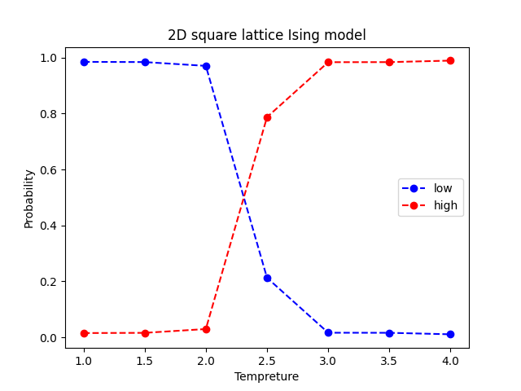
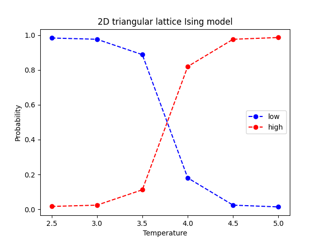

# Ising Phase Classification


## Description

Detect critical temperature of 2-dimensional Ising model by neural network.

## Install

```
git clone https://github.com/mktj2685/IsingPhaseClassification.git
cd IsingPhaseClassification
pip install -r requirements.txt
```

## Usage

### train

```
python train.py
```

### test

```
python test.py
```

## Result

<div align="center">

&nbsp;&nbsp;&nbsp;&nbsp;&nbsp;

</div>

## Reference

[1] J. Carrasquilla and R. G. Melko, “Machine learning phases of matter,” Nat. Phys. 13, 431 (2017)